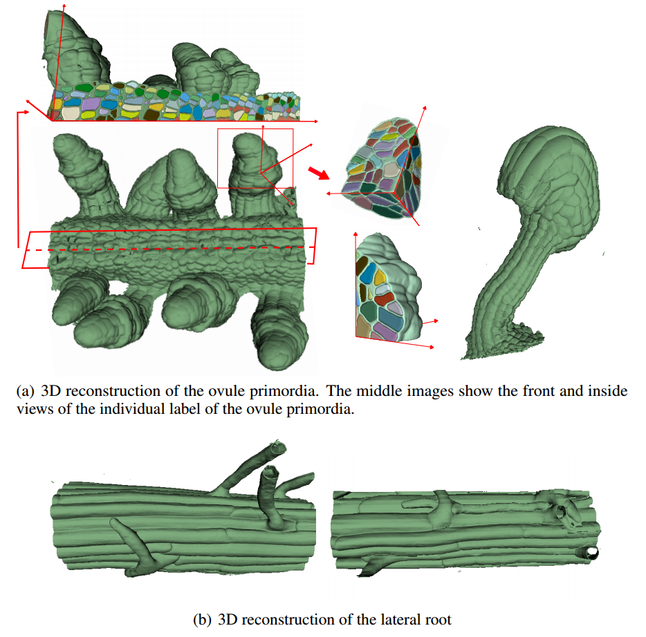

# Topology-aware method to segment 3D plant tissues images.

This repo is the official implementation of Topology-aware method to segment 3D plant tissues images. (Paper link; https://www.lrde.epita.fr/wiki/Publications/movn.22.nips) accepted by NeurIPS 2022 workshop (AI4science).

Authors: Minh Ôn Vũ Ngọc et al.

## Abstract

The study of genetic and molecular mechanisms underlying tissue morphogenesis has received a lot of attention in biology. Especially, accurate segmentation of tissues into individual cells plays an important role for quantitative analyzing the development of the growing organs. However, instance cell segmentation is still a challenging task due to the quality of the image and the fine-scale structure. Any small leakage in the boundary prediction can merge different cells together, thereby damaging the global structure of the image. In this paper, we propose an end-to-end topology-aware 3D segmentation method for plant tissues. The strength of the method is that it takes care of the 3D topology of segmented structures. Our method relies on a common deep neural network. The keystone is a training phase and a new topology-aware loss - the CavityLoss - that are able to help the network to focus on the topological errors to fix them during the learning phase. The evaluation of our method on both fixed and live plant organ datasets shows that our method outperforms state-of-the-art methods (and contrary to state-of-the-art methods, does not require any post-processing stage). The code of CavityLoss is freely available at https://github.com/onvungocminh/CavityLoss.

## Our Proposed pipeline


## Visualize results




## Dependencies

- Python libarary:
  - pytorch>=1.0
  - torchvision
  - numpy
  - scipy
  - opencv-python


## How to use this loss

Compile the loss:
```bash
python setup.py build
python setup.py install
```

## Citation

```
@inproceedings{ngocminh2022,
  title={Topology-aware method to segment 3D plant tissues images},
  author={Minh, On Vu Ngoc and Nicolas, Boutry and Jonathan, Fabrizio},
  booktitle={Advances in Neural Information Processing Systems workshop},
  year={2023}
}
```

## Contact
If you have any questions, please feel free to contact vungocminhpn@gmail.com


